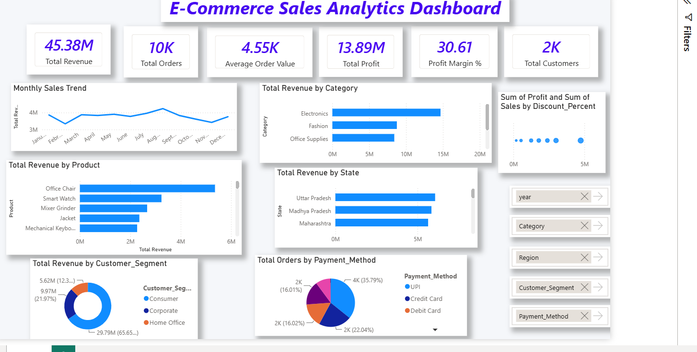

````md
# E-Commerce Sales Analytics Dashboard

> End-to-end Data Analytics portfolio project transforming raw e-commerce sales data into actionable business insights.

[](https://www.python.org/)
[](https://powerbi.microsoft.com/)
[](https://www.mysql.com/)
[](https://www.microsoft.com/excel)
[](https://pandas.pydata.org/)
[](https://numpy.org/)
[](https://matplotlib.org/)

---

## 📌 Project Banner



This project showcases a complete analytics workflow from raw transaction data to an interactive dashboard, demonstrating strong capabilities in data cleaning, business intelligence, SQL analysis, and dashboard design.

---

## 1. Project Overview

This is a professional Data Analytics portfolio project focused on e-commerce sales performance. The project uses a real-world-style transactional dataset to answer critical business questions and deliver insight through a polished Power BI dashboard.

It highlights the full analytics lifecycle:

- Data collection and preparation
- Data cleaning and validation
- Exploratory Data Analysis (EDA)
- SQL-based analysis
- Business intelligence dashboard development

The goal is to support decision-making with clear, actionable insights around sales, profit, customer behavior, product performance, regional trends, and discount impact.

---

## 2. Dashboard Preview


The dashboard includes KPI cards, trend visualizations, category/product breakdowns, geographic sales analysis, customer segmentation, and interactive slicers for deeper exploration.

---

## 3. Tools & Technologies

| Tool               | Role in Project                               |
| ------------------ | --------------------------------------------- |
| Microsoft Excel    | Data cleaning, validation, and quality checks |
| Python             | Data analysis and visualization               |
| Pandas             | Data manipulation and transformation          |
| NumPy              | Numerical calculations                        |
| Matplotlib         | Charts and visualizations                     |
| MySQL / phpMyAdmin | Database creation and SQL analysis            |
| Power BI           | Interactive dashboard and KPI reporting       |

---

## 4. Dataset Information

- Dataset Type: E-commerce Sales Data
- Total Rows: 10,000
- Key Dimensions:
  - Orders
  - Customers
  - Products
  - Categories
  - States / Regions
  - Payment Methods
  - Discounts
  - Sales and Profit

The dataset was cleaned and prepared before being used for analysis and visualization.

---

## 5. Project Workflow

1. Imported the raw e-commerce dataset.
2. Cleaned the data in Excel:
   - Removed duplicates
   - Handled missing values
   - Verified data quality and consistency
3. Performed Python-based analysis:
   - Used Pandas for transformation
   - Used NumPy for calculations
   - Used Matplotlib for charts and visual summaries
4. Built SQL analysis:
   - Created a database and table
   - Imported the cleaned dataset
   - Wrote SQL queries for business insights
5. Developed a Power BI dashboard:
   - KPI cards
   - Monthly sales trend
   - Revenue by category and product
   - Revenue by state
   - Customer segment analysis
   - Payment method analysis
   - Discount vs. profit analysis

---

## 6. Key KPIs

| KPI                 | Description                           |
| ------------------- | ------------------------------------- |
| Total Revenue       | Overall sales generated               |
| Total Profit        | Net profit earned                     |
| Total Orders        | Number of orders processed            |
| Total Customers     | Number of unique customers            |
| Average Order Value | Revenue per order                     |
| Profit Margin %     | Profit percentage relative to revenue |

---

## 7. Dashboard Features

The Power BI dashboard includes:

- 📈 KPI cards for business overview
- 📅 Monthly sales trend visualization
- 🏷️ Revenue analysis by category
- 🛍️ Revenue analysis by product
- 🌍 Revenue analysis by state
- 👥 Customer segment analysis
- 💳 Payment method analysis
- 📉 Discount vs. profit scatter plot
- 🎛️ Interactive slicers for dynamic filtering

---

## 8. Business Insights

This project answers critical business questions such as:

- What is the total revenue and profit?
- How many orders were placed?
- Who are the top customers?
- Which product and category lines drive the highest revenue?
- Which states contribute the most sales?
- How do discounts influence profit?
- What is the monthly sales trend?
- How do customer segments and payment methods impact performance?

These insights help business stakeholders understand growth opportunities, product performance, customer behavior, and profitability patterns.

---

## 9. Key Achievements

- ✅ Cleaned and validated a 10,000-row e-commerce dataset
- ✅ Built a structured data preparation workflow using Excel and Python
- ✅ Performed exploratory data analysis and generated business metrics
- ✅ Created SQL queries to support analytical reporting
- ✅ Designed an interactive Power BI dashboard for executive-level insights
- ✅ Delivered a portfolio-ready project aligned with real-world analytics practices

---

## 10. Folder Structure

```text
Ecommerce-Sales-Analysis/
│
├── data/
│   ├── raw/
│   └── cleaned/
│
├── excel/
├── notebooks/
├── sql/
├── powerbi/
├── images/
├── README.md
└── requirements.txt
```
````

---

## 11. SQL Analysis

The SQL component includes:

- Creating a database and table
- Importing the cleaned dataset into MySQL/phpMyAdmin
- Writing business-focused SQL queries
- Extracting insights related to revenue, profit, segmentation, and product performance

This demonstrates competence in relational databases and query writing for analytics workflows.

---

## 12. Python Analysis

The Python workflow includes:

- Data loading and inspection
- Cleaning and preprocessing
- Exploratory Data Analysis (EDA)
- Summary statistics and KPI calculation
- Visualizations using Matplotlib

Key Python libraries used:

- Pandas
- NumPy
- Matplotlib

---

## 13. Power BI Dashboard

The Power BI dashboard is designed to provide a professional and intuitive view of business performance. It combines KPIs, trends, and breakdowns into a single decision-support interface.

Highlights:

- Clear visual storytelling
- Executive-friendly KPI design
- Interactive filtering
- Business-focused reporting structure

---

## 14. Skills Demonstrated

This project showcases the following skills:

- Data Cleaning
- Exploratory Data Analysis (EDA)
- Business Intelligence
- SQL Query Writing
- Data Visualization
- Dashboard Development
- KPI Design
- Business Insights
- Power BI
- Excel
- Python
- SQL

---

## 15. Future Improvements

Possible enhancements for future versions:

- Add predictive analytics and sales forecasting
- Integrate live or cloud-based data sources
- Expand customer behavior and retention analysis
- Publish the dashboard to Power BI Service
- Create a web-based dashboard for broader accessibility

---

## 16. How to Run the Project

1. Clone the repository:

   ```bash
   git clone <your-repository-link>
   ```

2. Navigate to the project folder:

   ```bash
   cd Ecommerce-Sales-Analysis
   ```

3. Install Python dependencies:

   ```bash
   pip install -r requirements.txt
   ```

4. Open the notebook in the notebooks folder:

   ```bash
   jupyter notebook
   ```

5. Import the cleaned data into MySQL/phpMyAdmin for the SQL analysis workflow.

6. Open the Power BI file in the powerbi folder to view the dashboard.

<p align="center">
    
</p>
